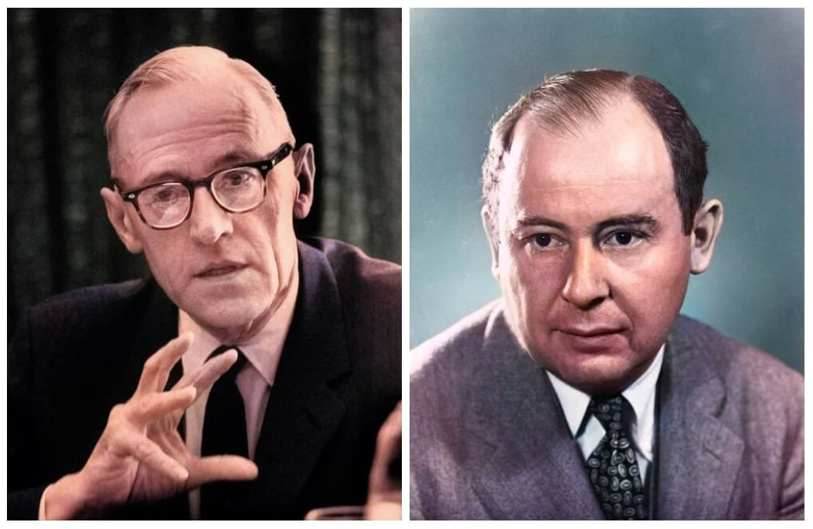
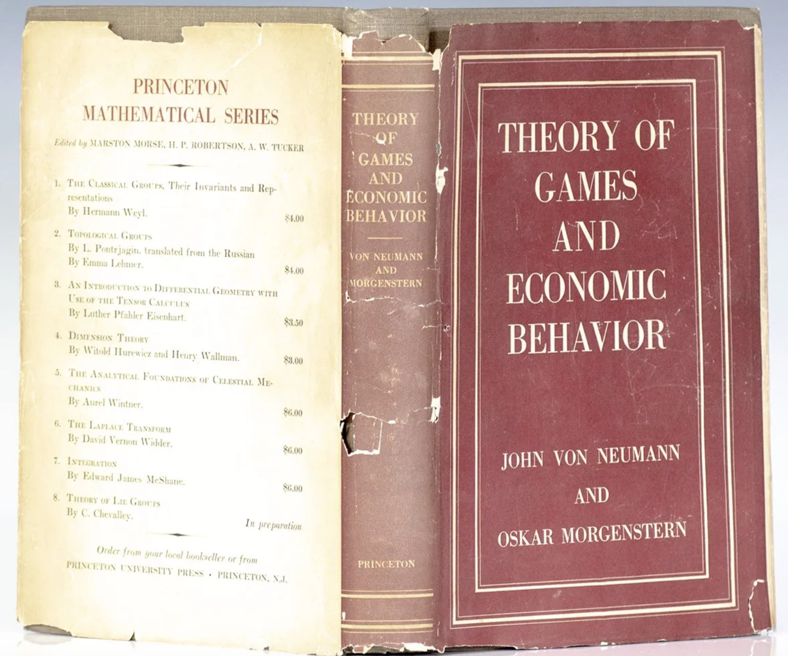
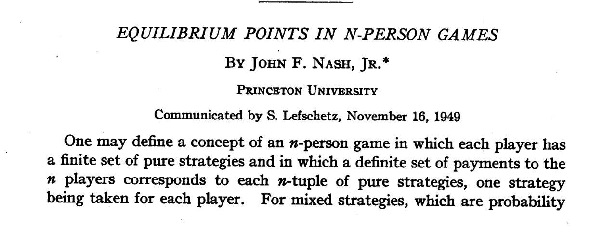

# Introductory Game Theory, Lecture 1

Xiaoye Liao · Fall 2026

<!-- source: ../pdf/lecture_2.pdf (13 pages: title, 2 section dividers, 10 numbered slides) -->

## Game Theory: What Is It about?

### Strategic situation

<!-- slide 1/10 -->

- A strategic situation is a state of affairs in which the *outcome* depends on the *decisions of all parties* (individuals, organizations, etc.).
- This implies that each party's *payoff* (i.e., the subjective evaluation of the outcome) depends on other parties' decisions.
- So strategic situations are those that feature *payoff interdependence*.
- Such payoff interdependence typically implies *strategic interdependence*, namely, how each party will behave relies on how other parties will behave.

<!-- slide 2/10: Strategic situations (cont.) -->

Strategic situations are abundant in our real world.

**Examples of strategic situations**

- Wars
- Bidding in auctions
- Cellphone pricing
- Penalty kick in football matches

**Examples of non-strategic situations**

- Deciding what to eat for dinner today
- Choosing your consumption bundle on competitive markets

<!-- slide 3/10: Strategic situation (cont.) -->

**A brief history about thoughts:**

- The investigation of strategic situations can be traced back to ancient times. The most stark example is the military treaties *The Art of War* by Sun Tzu (5th century BC), which is the first systematic theory about one of the most important strategic situations—war.
- The modern idea of strategic situation originated from *games* (by its literal meaning) like nim, chess, and hex, which are obvious examples that feature payoff interdependence.
- People later realized that all strategic situations could be analyzed under a uniform framework. Thus, the term "game" has been extended to mean all mathematical models of strategic situations.

### Game theory

<!-- slide 4/10 -->

- Under the uniform framework, people have developed a modern theory which investigates *rational decision making* in mathematical models of strategic situations (i.e., games).
- Such a theory is thus called *game theory*.
- Uniform framework:
  - (i) The uniform representation of key factors of a strategic situation, which transforms the original situation into a game;
  - (ii) Exploring the implication of *rationality* in games, which generates a general principle of "reasonable outcomes", called *solution concepts*.

### A brief history of game theory

<!-- slide 5/10 -->

- Early development of game theory was not systematic and was scattered in the discussion of concrete cases.
  - Military books: *The Art of War*, *Sun Bin's Art of War*, *Thirty-six Stratagems*, etc.;
  - J. Waldegrave (1713) proposed a *minimax mixed strategy solution* to a two-person card game;
  - E. Zermelo (1913) proved that for games like chess there exists a strategy that guarantees that some player will never lose;
  - E. Borel (1938) proved a *minimax theorem* for a special two-person zero-sum game;
  - A. Cournot (1838) and J. Bertrand (1883) each proposed a model of *oligopolistic competition* and a solution.

<!-- slide 6/10: A brief history of game theory (cont.) -->

- The birth of modern game theory: *On the Theory of Games of Strategy* (1928) by J. von Neumann (1903-1957), and the publication of the book *Theory of Games and Economic Behavior* (1944) by J. von Neumann and O. Morgenstern (1902-1977).

Morgenstern and von Neumann

*Theory of Games and Economic Behavior*

- Laid down the foundations for modern game theory (unified framework, basic notions, and paradigm of analysis);
- Focusing on a particular class of games: *zero-sum games*.

<!-- slide 7/10: A brief history of game theory (cont.) -->

- A landmark in the development of game theory: *Equilibrium Points in $n$-person Games* (PNAS, 1950) by J. Nash (1928-2015).

John F. Nash

Title of the paper *Equilibrium Points in $n$-person Games*

- Proposed the fundamental solution concept of *Nash equilibrium*, which is widely applicable to strategic analysis (not just zero-sum games);
- Laid down the principle of rationality in strategic situations;
- Most modern development in solution concept is based on Nash equilibrium.

## Formal Ingredients of Strategic Situations

### Four basic ingredients

<!-- slide 8/10 -->

- There are four key factors for describing a strategic situation:
  1. The set of involved parties, called *players* or sometimes *agents*
  2. The set of feasible *actions/choices* for each player
  3. The *payoffs* associated with each possible outcome
  4. The *information/knowledge* players have about the three factors above, others' decisions, and others' knowledge/information
- The four ingredients form the *structure* of a strategic situation.

### Some clarification

<!-- slide 9/10 -->

- A player is not necessarily an individual, but a decision-making entity that is appropriately defined when setting up the model.
- A player's payoff from an outcome is his/her evaluation (satisfaction/desirability/utility) of the outcome. We often assume that every player evaluates an uncertain outcome by its expected payoff.
- A player's knowledge needs to specify not only what he/she knows about external parameters (like payoffs), but also what he/she knows about the other players' knowledge and beliefs about these parameters, as well as what he/she knows about the other players' knowledge of his/her own belief, and so on.
- Unless declared otherwise, we will assume that the set of players, players' feasible actions, and players' payoffs are *common knowledge*:
  - Every player knows it;
  - Every player knows that every player knows it;
  - Every player knows that every player knows that every player knows it;
  - … (ad infinitum)

### Example

<!-- slide 10/10 -->

Consider the situation that you ($A$) and your friend ($B$) play rock-paper-scissors.

- Set of players: $\{A, B\}$;
- Feasible set of actions for each player: $a_A, a_B \in \{R, P, S\}$, $a_i$ being the action for player $i$, $i \in \{A, B\}$;
- Payoffs: $u_A(a_A, a_B)$ and $u_B(a_A, a_B)$, where

  $$
  \begin{gathered}
  u_A(R, S) = u_A(S, P) = u_A(P, R) = 1 \\
  u_A(R, R) = u_A(P, P) = u_A(S, S) = 0 \\
  u_A(S, R) = u_A(P, S) = u_A(R, P) = -1
  \end{gathered}
  $$

  and $u_B(a_A, a_B) = -u_A(a_A, a_B)$ for every $(a_A, a_B)$.
- The above factors are common knowledge.
