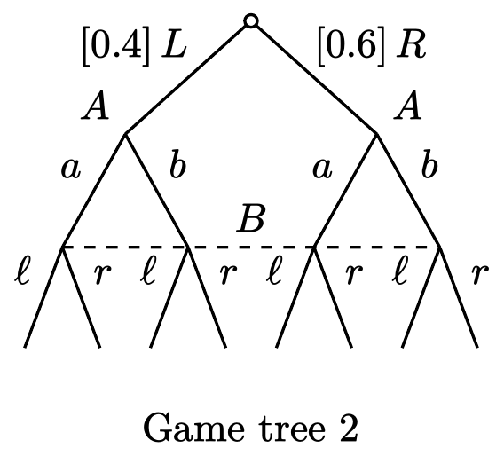
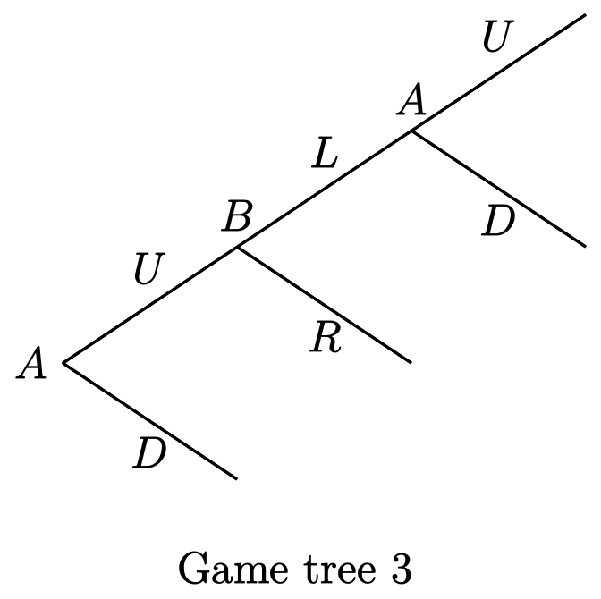
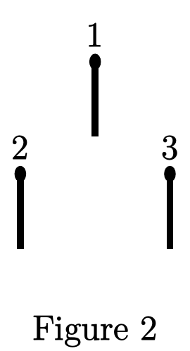
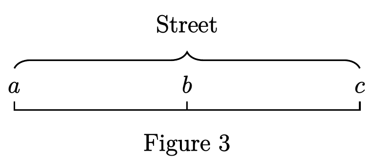

# Problem Set 1

Econ 315 · Game Theory for Economics · Fall 2026 · Instructor: Xiaoye Liao

<!-- source: ../pdf/ps1.pdf (4 pages) -->

<!-- page 1/4 -->

## Problem 1

For each of the four game trees (without payoffs) below,

- (a) describe the set of players, the set of feasible actions for each player, and find the set of all possible pure strategy profiles;
- (b) identify the information set(s) for each player;
- (c) describe how much each player knows/observes about the history of play in the game;
- (d) determine if it represents a game with perfect information;
- (e) determine if it represents a game with incomplete information.

## Problem 2

For the game tree (without payoffs) and behavior strategy profile shown in Figure 1, spot all the violations of the principles for extensive-form representation and strategies in extensive-form games.

<!-- page 2/4 -->

## Problem 3

Draw the game tree for each of the following strategic situations.

- (a) Two players, $A$ and $B$, are playing *nim* as specified below. As shown in Figure 2, three matches, labeled 1, 2, and 3, are initially arranged into two rows on a table. The two players take turns removing matches. Each time a player has to remove at least one match if there is any match left on the table, and each time one can only remove matches from the same row. The game ends as soon as all matches have been removed, and the one who makes the last removal loses (the other player wins). The winner receives a payoff of 1 and the loser $-1$. Suppose $A$ moves first.

  

- (b) Two players, $A$ and $B$, are playing rock-paper-scissors in a sequential manner: They first flip a fair coin to determine who moves first. The first mover's action is observed by the second mover, upon which the second mover makes a decision. The payoffs are the same as those specified on the slides (see page 10 of the lecture slides).

- (c) There are two retailers, $A$ and $B$. Each of them is deciding where to open a new grocery store on a street. As illustrated in Figure 3, three locations $a$, $b$, and $c$ are available, where $b$ is the middle point of the street. Both retails have to make their decisions simultaneously and both choosing the same location is allowed (i.e., the two stores can be at the same location but on different sides of the street). All potential customers of the grocery stores are residents living on the street, and their homes are uniformly distributed on the street. Each resident will buy from the store that is closer to his/her home. After choosing the location, a retailer's payoff equals the fraction of residents who choose to consume in its store (for simplicity, the fraction can be any real number in $[0, 1]$). If the two stores are equally distant for a group of residents, then half of them will choose store $A$ and the other half will choose store $B$.

  <!-- page 3/4 -->

  

- (d) Two bidders, 1 and 2, simultaneously submit bids for an object. A bid has to be a number from $\{0, 2\}$, with bidder $i$'s bid denoted by $b_i$. The value of the object to bidder $i$ is denoted by $v_i$, which is equal to either 0 or 2. Each player knows his own value of the object, but does not know the value of the other player. Instead, it is common knowledge that the likelihood for the other player to have a value of 2 is equal to 0.5, but different bidders' values are independent. The higher bid wins the object and the winner pays his own bid. If both bid the same price, then bidder 1 wins the object and pays his own bid. The loser pays 0. Bidder $i$ enjoys a payoff of $v_i - b_i$ if he wins, and 0 otherwise.

## Problem 4

Consider the game represented in Figure 4 (without payoffs).

- (a) List all pure strategy profiles for this game (note that a strategy profile consists of the strategy of every player in a game).
- (b) Describe graphically the strategy profile $(\sigma_A, \sigma_B)$ in the game tree, where
  - $\sigma_A(\varnothing) = 0.1S \oplus 0.4L \oplus 0.5R$, $\sigma_A(L\ell) = \sigma_A(Lr) = a$, and $\sigma_A(R\ell) = \sigma_A(Rr) = b$;
  - $\sigma_B(L) = \sigma_B(R) = \ell$.
- (c) For the strategy profile given in (b) and each player, determine if the player is playing a behavior strategy (that involves non-trivial randomization)/pure strategy.

- (d) Write a strictly mixed strategy for player $B$ and a totally mixed strategy for player $A$.

## Problem 5

Consider the extensive-form game given in Figure 5 (without payoffs). Suppose player $A$'s strategy is

$$
\sigma_A(U) = \sigma_A(D) = \frac{1}{2}L \oplus \frac{1}{2}R
$$

<!-- page 4/4 -->

and player $B$'s strategy satisfies

$$
\sigma_B(UL) = \frac{1}{3}u \oplus \frac{2}{3}d, \quad \sigma_B(DR) = \frac{2}{3}u \oplus \frac{1}{3}d.
$$

- (a) Does $A$ know Nature's choice? Does $B$ know Nature's choice? Does $B$ know $A$'s choice? Explain.
- (b) What is $\sigma_B(UR)$? What is $\sigma_B(DL)$? Explain.
- (c) What is the distribution over terminal nodes generated by $(\sigma_A, \sigma_B)$?
- (d) Find a mixed strategy for each player, which will generate the same probability distribution over the terminal nodes as $(\sigma_A, \sigma_B)$ does.

