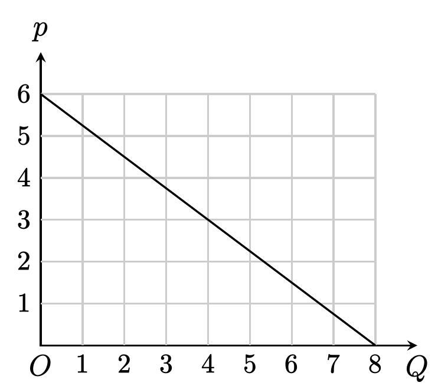
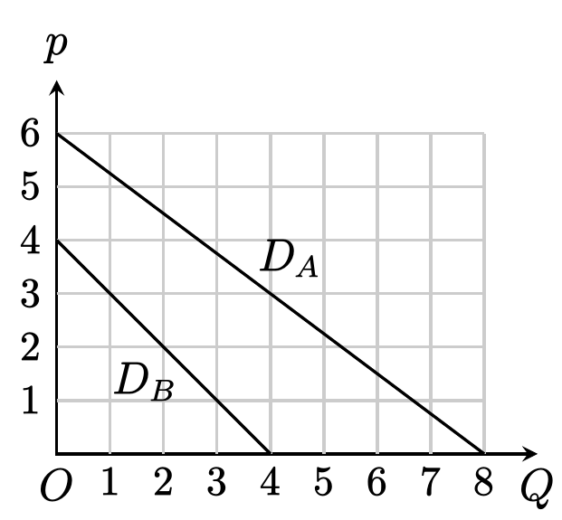

# Problem Set 13

Econ 211 · Microeconomics II · Spring 2026 · Instructor: Xiaoye Liao

<!-- source: ../ps_13_micro2_monopoly_part.pdf (4 pages) -->

<!-- page 1/4 -->

## Problem 1

The demand curve of a good is the downward sloping segment shown in Figure 1.

Figure 1

- (a) When is the demand elastic/inelastic/unit-elastic?
- (b) Draw in the figure the demand curve faced by a competitive firm on the market, provided that the competitive equilibrium price on the market is $p^c = 3$. How many units of the good will be transacted in the competitive equilibrium?
- (c) Draw the marginal revenue curve for a monopolist on this market which adopts a linear pricing strategy.

## Problem 2

A monopolist has a cost function given by $C(Q) = Q^2$. The market demand curve for its product is $Q(p) = 120 - p$.

- (a) Derive the expression for the firm's marginal revenue as a function about $p$ and $Q$, respectively.
- (b) Find the optimal monopolistic linear price $p^m$ and the corresponding quantity of output $Q^m$.
- (c) Calculate the elasticity of the demand curve at $(Q^m, p^m)$ using the Lerner index of the monopolist.
- (d) Find the deadweight loss caused by monopoly on this market. How much consumer surplus loss do consumers suffer on this market as compared with in the competitive equilibrium?
- (e) Is it possible to eliminate the inefficiency caused by monopoly by imposing a price cap on the market? If yes, find the price cap; if no, justify your answer.

## Problem 3

Consider the market for H-Jeans, which are produced and sold by a single firm which carries the patent for the design. On the demand side, there are 200 consumers who are willing to pay at most $p^H = 20$ for a pair of H-Jeans, 100 consumers who are willing to pay at most $p^M = 15$ for a pair of H-Jeans, and 50 consumers who are willing to pay at most $p^L = 10$ for each pair of H-Jeans. Each consumer chooses whether to buy one pair of jeans or not to buy it at all. Suppose the firm can produce each pair of H-Jeans at a constant cost of $c = 8$.

<!-- page 2/4 -->

- (a) Identify the formula for the demand curve of H-Jeans and draw it.
- (b) If the firm has to price its product linearly, what is the optimal linear price for the monopolist? How many pairs of H-Jeans will the firm sell on the market? What is the firm's profit? What is the firm's Lerner index?
- (c) If the firm can exercise first-degree price discrimination, how much will it charge each type of consumers? How many pairs of H-Jeans will the firm produce and sell in the market?

## Problem 4

Andrew's demand for a service is $Q(p) = a - bp$ with $a, b > 0$. The provision of the service is monopolized by a company, which offers the service at a cost of $C(Q) = cQ$, where $c < a/b$.

- (a) If the company cannot conduct any price discrimination, what price will it charge Andrew for each unit of the service?
- (b) If the company exercises first-degree price discrimination, find the quantity of the service that will be sold to Andrew and the total price Andrew will be charged.
- (c) Suppose the company implements the first-degree price discrimination with a two-part tariff. Find the corresponding fixed fee and per unit price for Andrew.

## Problem 5

A monopolist faces two consumers $A$ and $B$, whose demand curves (both being segments and being labeled $D_A$ and $D_B$, respectively) are plotted together in Figure 2. Suppose the monopolist cannot distinguish the two consumers, and so it would like to exercise second-degree price discrimination by offering a menu of plans

$$
M = \{(Q_A, P_A), (Q_B, P_B)\},
$$

where $(Q_i, P_i)$ is the plan designed for consumer $i$, $Q_i$ being the quantity sold to the consumer and $P_i$ being the total price the consumer will be charged, $i \in \{A, B\}$.

Figure 2

- (a) Table 1 specifies two menus of plans. For each of them, determine whether it is individually rational (i.e., for each consumer, choosing the plan designed for him is no worse than not choosing any of the plans).
- (b) For each of the two menus as specifed in Table 1, determine whether it is incentive compatible (i.e., for each consumer, whether it is better to choose the plan designed for him rather than the other one).

<!-- page 3/4 -->

|        | $Q_A$ | $P_A$ | $Q_B$ | $P_B$ |
| ------ | :---: | :---: | :---: | :---: |
| Menu 1 |   8   |  10   |   4   |   8   |
| Menu 2 |   4   |  15   |   3   |   9   |

Table 1

- (c) Suppose the plan for consumer $B$ (the low-demand consumer) has been fixed at $(Q_B, P_B) = (4, 6)$. Calculate the least information rent the monopolist has to give consumer $A$ by offering an incentive compatible menu of plans.

## Problem 6

Consider the example of second-degree price discrimination discussed in class (see page 20 of the lecture slides). In this exercise, you need to find the optimal quantity that should be sold to consumer $B$ (i.e., the low-demand consumer), provided that the monopolist will sell $Q_A^1$ to consumer $A$. To facilitate our analysis, we assume that consumer $A$'s inverse demand curve is $P^A(Q) = a - bQ$, and that consumer $B$'s inverse demand curve is $P^B(Q) = c - dQ$, where $a > c$, $a/b > c/d$, and $a, b, c, d > 0$.

- (a) Let $\pi(q)$ be the highest possible profit the monopolist can obtain by offering an incentive compatible menu of plans that sells $Q_A^1$ to $A$ and $q$ to $B$. Write the expression for $\pi(q)$.
- (b) Find the expression for $\pi'(q)$. Use this to argue that the optimal choice for $q$ cannot be $Q_B^1$.
- (c) Find the value of $q$ that maximizes $\pi(q)$. How does your answer depend on the parameters $a$, $b$, $c$, and $d$? When will the monopolist find it optimal to sell only to one of the consumers?
- (d) Under the optimal menu of plans, how much information rent does each of the two consumers receive? What is the associated deadweight loss?
- (e) Let $q^*$ denote the value of $q$ that maximizes $\pi(q)$. If $q^* > 0$, what is the numerical relationship between $P^A(q^*)$ and $P^B(q^*)$? Illustrate this relationship geometrically in a coordinate system where the two demand curves are plotted together.

## Problem 7

A manufacturer sells its products in Brazil and India. The demand from the Brazilian market and that from the Indian market are, respectively,

$$
Q_B = \left(\frac{A_b}{p}\right)^2 \quad \text{and} \quad Q_I = \left(\frac{A_i}{p}\right)^5,
$$

where $A_b, A_i > 0$ are two constants. The marginal cost of the manufacturer is constantly equal to $c > 0$.

- (a) Calculate the price elasticity of demand in each of the two markets.

<!-- page 4/4 -->

- (b) If the firm can exercise third-degree price discrimination, use the inverse elasticity rule to find the optimal prices for the two markets, respectively.
- (c) In which country does the manufacturer have a higher market power? Explain.

## Problem 8

A small biotech company develops a new treatment for a rare disease. The new treatment is patented and the company is the sole supplier of the treatment. The company can sell the treatment to private pharmacies and public hospitals. The pharmacies' demand for the treatment is

$$
Q_p = 84 - 0.4p
$$

and the public hospitals' demand for the treatment is

$$
Q_h = 116 - 0.6p.
$$

The marginal cost of offering the treatment is $MC(Q) = 20 + 2Q$. Suppose the current regulations ban price discrimination.

- (a) Find the company's optimal price.
- (b) Calculate the volumes of treatment that are optimally sold to private pharmacies and public hospitals, respectively.

Now suppose that the legislature passes a new Health Costs Relief Act (HCRA) that allows biotech companies to exercise third-degree price discrimination.

- (c) Once the new law is enacted, what will be the price for pharmacies? What will be the price for public hospitals? How many units of treatment will be sold to pharmacies and public hospitals, respectively?
- (d) Do private pharmacies benefit from the new HCRA? Do public hospitals benefit from the new HCRA? Justify your answer by calculating the welfare change caused by the new HCRA for private pharmacies and public hospitals, respectively.
